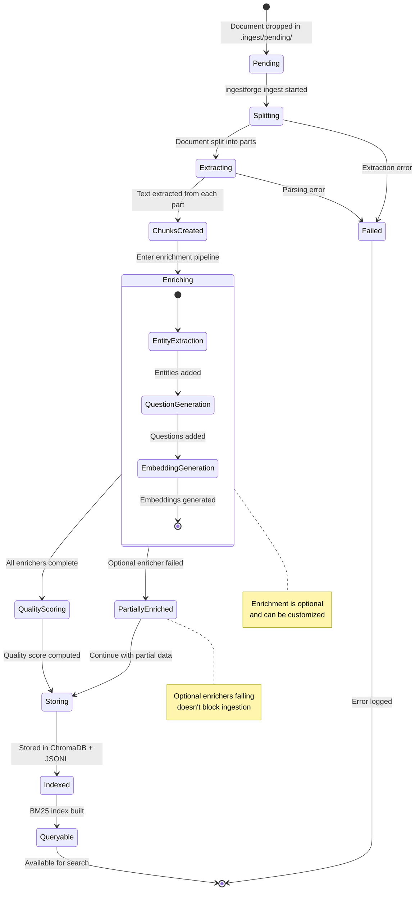

# Chunking Module

## Purpose

Split documents into semantic chunks for retrieval. Provides multiple chunking strategies (semantic, legal, code) that preserve document structure and enable precise citations. Each chunk tracks its source location for academic references.

## Architecture Context

The `chunking/` module transforms extracted text into retrievable chunks. It sits between document ingestion and enrichment in the pipeline.

```
┌─────────────────────────────────────────┐
│   ingest/ - Extract text                │
│            ↓                             │
│   chunking/ - Split into chunks         │  ← You are here
│   (semantic, legal, code strategies)    │
│            ↓                             │
│   enrichment/ - Add embeddings          │
└─────────────────────────────────────────┘
```

**Key Decision:** Why chunking matters for RAG:
- Too small → loses context
- Too large → retrieves irrelevant content
- Semantic boundaries → preserves meaning

## Key Components

| Component | Purpose | Status |
|-----------|---------|--------|
| `semantic_chunker.py` | SemanticChunker + ChunkRecord dataclass | ✅ Complete |
| `legal_chunker.py` | Split legal docs by numbered sections | ✅ Complete |
| `code_chunker.py` | AST-based code chunking by function/class | ✅ Complete |
| `size_optimizer.py` | Optimize chunk sizes post-split | ✅ Complete |
| `deduplicator.py` | Remove duplicate/overlapping chunks | ✅ Complete |
| `quality_scorer.py` | Score chunk quality (deprecated - moved to enrichment) | ⚠️ Legacy |

## ChunkRecord Data Structure

**Purpose:** Container for chunk content with full provenance tracking.

Every chunk knows exactly where it came from, enabling precise citations like "[Smith 2023, Ch.3 §2.1, p.47]".

```python
@dataclass
class ChunkRecord:
    # Identity
    chunk_id: str                    # Unique ID
    document_id: str                 # Source document
    content: str                     # Chunk text
    chunk_type: str                  # content, concept, definition, etc.

    # Hierarchy
    section_title: str               # "Introduction"
    section_hierarchy: List[str]     # ["Chapter 1", "Section 1.1"]

    # Metadata
    source_file: str                 # "paper.pdf"
    page_start: int                  # Starting page
    page_end: int                    # Ending page
    word_count: int
    char_count: int
    paragraph_number: Optional[int]

    # Position
    chunk_index: int                 # Position in document
    total_chunks: int                # Total chunks in document

    # Provenance (for citations)
    source_location: Optional[SourceLocation]

    # Enrichment (filled later)
    embedding: Optional[List[float]]
    entities: Optional[List[str]]
    concepts: Optional[List[str]]
    hypothetical_questions: Optional[List[str]]

    # Quality
    quality_score: float
    difficulty: str                  # beginner, intermediate, advanced
```

**Usage:**

```python
from ingestforge.chunking import ChunkRecord

chunk = ChunkRecord(
    chunk_id="doc-001_chunk_0",
    document_id="doc-001",
    content="Quantum computing uses quantum...",
    chunk_index=0,
    total_chunks=42,
)

# Get citation
cite = chunk.get_citation(style="short")
# Output: "[paper.pdf, p.1]"

# With full provenance
chunk.source_location = SourceLocation(...)
cite = chunk.get_citation(style="short")
# Output: "[Smith 2023, Ch.1, p.1]"

# Serialize
data = chunk.to_dict  # For storage
restored = ChunkRecord.from_dict(data)
```

## Chunk Lifecycle

**Purpose:** Understanding how chunks progress from document ingestion to being queryable.

The following state diagram shows the complete lifecycle of a chunk, from initial document drop through enrichment to being available for search:



**Key States:**

| State | Description | Next Action |
|-------|-------------|-------------|
| **Pending** | Document in `.ingest/pending/` | Waiting for `ingestforge ingest` |
| **Splitting** | Detecting chapters/sections | Extract text from each part |
| **Extracting** | Extracting raw text | Create initial ChunkRecords |
| **ChunksCreated** | ChunkRecords created | Begin enrichment |
| **Enriching** | Adding metadata, embeddings | Run enrichment pipeline |
| **QualityScoring** | Computing chunk quality | Prepare for storage |
| **Storing** | Saving to storage backends | Index for search |
| **Indexed** | Stored with vector index | Build keyword index |
| **Queryable** | Available for search | User can query |
| **Failed** | Error during processing | Logged, manual retry needed |
| **PartiallyEnriched** | Some enrichers failed | Continue with available data |

## Semantic Chunking Strategy

**Purpose:** Default chunking strategy that splits on semantic boundaries (paragraphs, sections).

**Algorithm:**
1. Split text into paragraphs
2. Group paragraphs until target size reached
3. Add overlap between chunks
4. Preserve section structure

**Configuration:**

```yaml
# config.yaml
chunking:
  strategy: semantic          # semantic, fixed, paragraph
  target_size: 300            # Target words per chunk
  min_size: 50                # Minimum chunk size
  max_size: 1000              # Maximum chunk size
  overlap: 50                 # Overlap in words
```

**Usage:**

```python
from ingestforge.chunking import SemanticChunker
from ingestforge.core import load_config

config = load_config
chunker = SemanticChunker(config)

# Chunk text
chunks = chunker.chunk(
    text="Chapter 1\n\nQuantum computing...",
    document_id="doc-001",
    source_file="paper.pdf",
    metadata={"author": "Smith", "year": 2023}
)

print(f"Created {len(chunks)} chunks")
for chunk in chunks:
    print(f"  {chunk.chunk_id}: {chunk.word_count} words")
```

**Strategies:**

| Strategy | Description | Use Case |
|----------|-------------|----------|
| `semantic` | Split on paragraphs, group to target size | General documents (default) |
| `fixed` | Fixed-size chunks with overlap | Consistent chunk sizes |
| `paragraph` | One chunk per paragraph | Short documents, tweets |

## Legal Document Chunking

**Purpose:** Chunk legal documents by numbered sections, preserving structure for precise citations.

**Recognized Patterns:**
- Numeric: `1.`, `1.1`, `1.1.1`
- Article: `Article 1`, `ARTICLE I`
- Section: `Section 1.1`, `Sec. 2`
- Paragraph: `§1`, `§ 1.1`, `¶1`
- Roman: `I.`, `II.`, `III.`
- Lettered: `(a)`, `(b)`, `(i)`, `(ii)`

**Usage:**

```python
from ingestforge.chunking import LegalChunker, chunk_legal_document

chunker = LegalChunker(config)

# Process legal text
legal_text = """
1. Definitions

This Agreement defines the following terms:

1.1 "Software" means the computer program...

1.2 "License" means the permission granted...

2. Grant of License

Subject to the terms...
"""

chunks = chunker.chunk(legal_text, "contract-001")

for chunk in chunks:
    print(f"{chunk.section_title}:")
    print(f"  Section: {chunk.section_hierarchy}")
    print(f"  Content: {chunk.content[:50]}...")

# Output:
# Definitions:
#   Section: ['1']
#   Content: This Agreement defines the following terms:...
# Software:
#   Section: ['1', '1.1']
#   Content: "Software" means the computer program...
```

**Convenience Function:**

```python
# Quick legal chunking
from ingestforge.chunking import chunk_legal_document

chunks = chunk_legal_document(
    text=legal_text,
    document_id="contract-001",
    config=config
)
```

## Code Chunking

**Purpose:** AST-based chunking for code files, splitting by semantic units (functions, classes).

**Supported Languages:**
- Python (via AST)
- JavaScript/TypeScript (regex fallback)
- Java, Go, Rust, C++, etc. (regex patterns)

**Semantic Units:**
- Classes (with methods grouped)
- Standalone functions
- Module-level code
- Import blocks

**Usage:**

```python
from ingestforge.chunking import CodeChunker, chunk_code

chunker = CodeChunker(config)

# Read Python file
code = Path("example.py").read_text

chunks = chunker.chunk(code, "example.py")

for chunk in chunks:
    print(f"{chunk.chunk_type}: {chunk.section_title}")
    print(f"  Lines: {chunk.page_start}-{chunk.page_end}")

# Output:
# function: calculate_embedding
#   Lines: 15-32
# class: SemanticChunker
#   Lines: 35-120
# method: chunk
#   Lines: 42-89
```

**Convenience Function:**

```python
# Quick code chunking
from ingestforge.chunking import chunk_code

chunks = chunk_code(
    code=code_text,
    filename="script.py",
    document_id="script-001"
)
```

**Code Unit Structure:**

```python
@dataclass
class CodeUnit:
    name: str                    # Function/class name
    kind: str                    # function, class, method
    content: str                 # Full code
    start_line: int
    end_line: int
    docstring: Optional[str]     # Extracted docstring
    parent: Optional[str]        # Parent class
    signature: Optional[str]     # Function signature
    decorators: List[str]        # @decorators
```

## Size Optimization

**Purpose:** Post-process chunks to optimize sizes (merge small, split large).

**Features:**
- Merge chunks below min_size
- Split chunks above max_size
- Preserve semantic boundaries
- Update chunk indices

**Usage:**

```python
from ingestforge.chunking import SizeOptimizer

optimizer = SizeOptimizer(
    min_size=100,   # Words
    max_size=500,   # Words
)

# Optimize chunks
optimized = optimizer.optimize(chunks)

# Get statistics
stats = optimizer.get_stats(chunks, optimized)
print(f"Before: {stats['before_count']} chunks")
print(f"After: {stats['after_count']} chunks")
print(f"Merged: {stats['merged_count']}")
print(f"Split: {stats['split_count']}")
```

## Deduplication

**Purpose:** Remove duplicate or highly overlapping chunks.

**Features:**
- Content-based hash deduplication
- Similarity-based deduplication (semantic)
- Configurable similarity threshold
- Preserves best chunk (highest quality score)

**Usage:**

```python
from ingestforge.chunking import Deduplicator

dedup = Deduplicator(
    method="hash",           # hash, similarity
    similarity_threshold=0.9
)

# Remove duplicates
unique_chunks = dedup.deduplicate(chunks)

# Get report
report = dedup.get_report
print(f"Removed: {report['duplicates_removed']}")
print(f"Kept: {report['chunks_kept']}")
```

**Methods:**

| Method | Description | Speed | Accuracy |
|--------|-------------|-------|----------|
| `hash` | Exact content match (SHA256) | Fast | 100% precise |
| `similarity` | Semantic similarity (embeddings) | Slow | Catches near-duplicates |

## Implementing IChunkingStrategy

All chunkers implement the `IChunkingStrategy` interface from `shared/patterns`.

**Template:**

```python
from ingestforge.shared.patterns import IChunkingStrategy
from ingestforge.chunking import ChunkRecord

class MyChunker(IChunkingStrategy):
    """Custom chunking strategy."""

    def chunk(self, text, document_id, source_file="", metadata=None):
        """Split text into chunks."""
        # Your chunking logic
        chunks = []

        # Example: split by custom delimiter
        parts = text.split("---CHUNK---")
        for i, part in enumerate(parts):
            chunk = ChunkRecord(
                chunk_id=f"{document_id}_chunk_{i}",
                document_id=document_id,
                content=part.strip,
                source_file=source_file,
                chunk_index=i,
                total_chunks=len(parts),
                word_count=len(part.split),
                char_count=len(part),
            )
            chunks.append(chunk)

        return chunks

    def get_strategy_name(self):
        return "my-custom-strategy"

# Use it
chunker = MyChunker
chunks = chunker.chunk("Part 1---CHUNK---Part 2", "doc-001")
```

## Usage Examples

### Example 1: Full Pipeline with Provenance

```python
from ingestforge.core import load_config
from ingestforge.core.provenance import create_pdf_source
from ingestforge.chunking import SemanticChunker

config = load_config
chunker = SemanticChunker(config)

# Create source location
source = create_pdf_source(
    file_path="paper.pdf",
    title="Quantum Computing",
    authors=["Alice Smith"],
    publication_date="2023",
)

# Chunk with provenance
chunks = chunker.chunk(
    text=extracted_text,
    document_id="paper-001",
    source_file="paper.pdf",
)

# Attach source location to each chunk
for chunk in chunks:
    chunk.source_location = source

# Now chunks have citations
for chunk in chunks:
    print(chunk.get_citation(style="short"))
    # Output: [Smith 2023, p.1]
```

### Example 2: Strategy Selection Based on Content

```python
def smart_chunk(text, document_id, file_path):
    """Select chunking strategy based on content."""
    config = load_config

    # Detect content type
    if is_legal_document(text):
        chunker = LegalChunker(config)
    elif file_path.suffix in ['.py', '.js', '.java']:
        chunker = CodeChunker(config)
    else:
        chunker = SemanticChunker(config)

    return chunker.chunk(text, document_id, str(file_path))

def is_legal_document(text):
    """Heuristic to detect legal documents."""
    legal_indicators = [
        r'\b(WHEREAS|AGREEMENT|CONTRACT)\b',
        r'\b(Article|Section)\s+\d+',
        r'\b(§|¶)\s*\d+',
    ]
    matches = sum(1 for pattern in legal_indicators
                  if re.search(pattern, text[:1000]))
    return matches >= 2
```

### Example 3: Chunk Optimization Pipeline

```python
from ingestforge.chunking import SemanticChunker, SizeOptimizer, Deduplicator

# 1. Initial chunking
chunker = SemanticChunker(config)
chunks = chunker.chunk(text, document_id, source_file)

# 2. Size optimization
optimizer = SizeOptimizer(min_size=100, max_size=500)
chunks = optimizer.optimize(chunks)

# 3. Deduplication
dedup = Deduplicator(method="hash")
chunks = dedup.deduplicate(chunks)

print(f"Final: {len(chunks)} chunks")
```

## Dependencies

### Required
- Python standard library (dataclasses, re, hashlib)
- `ingestforge.core` (for Config, SourceLocation)
- `ingestforge.shared` (for IChunkingStrategy)

### Optional
None - chunking module has no external dependencies

## Testing

```bash
# Run all chunking tests
pytest tests/test_chunking_*.py -v

# Test specific chunker
pytest tests/test_chunking_semantic.py -v
pytest tests/test_chunking_legal.py -v
pytest tests/test_chunking_code.py -v

# Test with coverage
pytest tests/test_chunking_*.py --cov=ingestforge.chunking --cov-report=html
```

## Common Patterns

### Pattern 1: Chunking with Quality Filtering

```python
from ingestforge.chunking import SemanticChunker
from ingestforge.shared.patterns import ChunkValidator

# Chunk text
chunker = SemanticChunker(config)
chunks = chunker.chunk(text, document_id)

# Filter low-quality chunks
validator = ChunkValidator(min_size=50, max_size=1000)
valid_chunks = validator.filter_valid(chunks)

# Log statistics
stats = validator.get_stats(chunks)
logger.info(f"Valid chunks: {stats['valid_count']}/{stats['total_count']}")
```

### Pattern 2: Multi-Strategy Chunking

```python
# Process document with multiple strategies
strategies = {
    'semantic': SemanticChunker(config),
    'legal': LegalChunker(config),
    'code': CodeChunker(config),
}

all_chunks = {}
for name, chunker in strategies.items:
    all_chunks[name] = chunker.chunk(text, document_id)

# Use best strategy based on result quality
best_strategy = max(all_chunks.items, key=lambda x: len(x[1]))
chunks = best_strategy[1]
```

## Troubleshooting

### Issue 1: Chunks Too Small

**Symptom:** Many chunks below min_size

**Cause:** Text has many short paragraphs

**Fix:**

```python
# Increase target size or use fixed strategy
config.chunking.target_size = 500  # Larger chunks
config.chunking.strategy = "fixed"  # Consistent sizes
```

### Issue 2: Legal Sections Not Detected

**Symptom:** LegalChunker creates one large chunk

**Cause:** Section numbering doesn't match patterns

**Fix:**

```python
# Check what patterns exist
import re
patterns = [
    r'^\d+\.',           # 1.
    r'^Article\s+\d+',   # Article 1
    r'^§\s*\d+',         # §1
]

for pattern in patterns:
    matches = re.findall(pattern, text[:1000], re.MULTILINE)
    print(f"{pattern}: {len(matches)} matches")

# Adjust or add custom patterns
```

### Issue 3: Code Chunks Missing Functions

**Symptom:** CodeChunker misses some functions

**Cause:** AST parsing failed or non-standard syntax

**Fix:**

```python
# Check for syntax errors
try:
    ast.parse(code)
except SyntaxError as e:
    print(f"Syntax error: {e}")
    # Fix code or use regex fallback
```

## References

- [ARCHITECTURE.md](../../ARCHITECTURE.md) - System overview
- [ADR-003: Semantic Chunking](../../docs/architecture/ADR-003-semantic-chunking.md)
- [ingestforge/shared/README.md](../shared/README.md) - IChunkingStrategy interface
- [ingestforge/enrichment/README.md](../enrichment/README.md) - Next step: enrichment
