# Shared Module

## Purpose

Reusable utilities and architectural patterns used across IngestForge features. Provides interfaces (IEnricher, IProcessor, IChunkingStrategy), text processing utilities, lazy import helpers, and metadata serialization to eliminate code duplication and ensure consistent APIs.

## Architecture Context

The `shared/` module sits between `core/` and feature modules, providing reusable patterns and utilities that reduce duplication and enforce architectural consistency.

```
┌─────────────────────────────────────────┐
│   Ingest, Enrichment, Query, Storage    │  Feature Modules
│   (implement shared interfaces)         │
├─────────────────────────────────────────┤
│   shared/ - Patterns & Utilities        │  ← You are here
│   (interfaces, text utils, helpers)     │
├─────────────────────────────────────────┤
│   core/ - Framework Infrastructure      │  Foundation
└─────────────────────────────────────────┘
```

**Key Insight:** Before `shared/` was created, features had 122 LOC of duplicated retry logic, inconsistent enricher APIs, and repeated text cleaning code. The `shared/` module eliminated these duplications and standardized interfaces.

## Key Components

| Component | Purpose | Status |
|-----------|---------|--------|
| `patterns/enricher.py` | IEnricher interface + EnrichmentPipeline | ✅ Complete |
| `patterns/processor.py` | IProcessor interface + ProcessorFactory | ✅ Complete |
| `patterns/chunking.py` | IChunkingStrategy interface + ChunkValidator | ✅ Complete |
| `text_utils.py` | Text cleaning, normalization, file reading | ✅ Complete |
| `lazy_imports.py` | Lazy loading decorator for optional dependencies | ✅ Complete |
| `metadata_serialization.py` | JSON helpers for SourceLocation | ✅ Complete |

## Interfaces

### IEnricher

**Purpose:** Standard interface for chunk enrichment (entities, questions, embeddings, quality scores).

**Contract:**
- `enrich_chunk(chunk) -> ChunkRecord` - Enrich single chunk (modify in-place)
- `enrich_batch(chunks, batch_size, continue_on_error) -> List[ChunkRecord]` - Enrich multiple chunks
- `is_available -> bool` - Check if enricher dependencies are available
- `get_metadata -> dict` - Return enricher metadata for logging

**Implementations:**
- `EntityExtractor` (ingestforge/enrichment/entities.py)
- `QuestionGenerator` (ingestforge/enrichment/questions.py)
- `EmbeddingGenerator` (ingestforge/enrichment/embeddings.py)
- `QualityScorer` (ingestforge/enrichment/quality.py)

**Usage:**

```python
from ingestforge.shared.patterns import IEnricher, EnrichmentPipeline
from ingestforge.enrichment.entities import EntityExtractor
from ingestforge.enrichment.embeddings import EmbeddingGenerator

# Use single enricher
enricher = EntityExtractor
if enricher.is_available:
    enriched_chunks = enricher.enrich_batch(chunks)

# Compose multiple enrichers
pipeline = EnrichmentPipeline([
    EntityExtractor,
    EmbeddingGenerator(config),
])
enriched_chunks = pipeline.enrich(chunks)
```

**Design Notes:**
- Enrichers modify chunks in-place (returns same instance)
- `enrich_batch` provides default sequential implementation; override for batch optimization
- `continue_on_error=True` allows partial success (failed chunks returned unenriched)

### IProcessor

**Purpose:** Standard interface for document processors (PDF, HTML, DOCX, etc.).

**Contract:**
- `can_process(file_path) -> bool` - Check if processor can handle file
- `process(file_path) -> ExtractedContent` - Extract text and metadata
- `get_supported_extensions -> List[str]` - Return supported file extensions

**Data Structure:**

```python
@dataclass
class ExtractedContent:
    text: str                              # Extracted text
    metadata: dict                         # Title, author, etc.
    sections: Optional[List[str]] = None   # Section hierarchy
    images: Optional[List[str]] = None     # Image paths
    tables: Optional[List[dict]] = None    # Extracted tables
```

**Implementations:**
- `PDFProcessor` (ingestforge/ingest/pdf_processor.py)
- `HTMLProcessor` (ingestforge/ingest/html_processor.py)
- `OCRProcessor` (ingestforge/ingest/ocr_processor.py)
- `MarkdownProcessor` (ingestforge/ingest/markdown_processor.py)

**Usage:**

```python
from ingestforge.shared.patterns import IProcessor, ProcessorFactory
from ingestforge.ingest.pdf_processor import PDFProcessor
from ingestforge.ingest.html_processor import HTMLProcessor

# Direct processor usage
processor = PDFProcessor
if processor.can_process(Path("doc.pdf")):
    content = processor.process(Path("doc.pdf"))
    print(content.text)
    print(content.metadata)

# Factory pattern (automatic selection)
factory = ProcessorFactory
factory.register(PDFProcessor)
factory.register(HTMLProcessor)

processor = factory.get_processor(Path("doc.pdf"))
content = processor.process(Path("doc.pdf"))
```

### IChunkingStrategy

**Purpose:** Standard interface for text chunking strategies (semantic, fixed-size, legal, code).

**Contract:**
- `chunk(text, document_id, source_file, metadata) -> List[ChunkRecord]` - Split text into chunks
- `get_strategy_name -> str` - Return strategy name
- `validate_text(text) -> bool` - Check if text is suitable for chunking
- `estimate_chunks(text) -> int` - Estimate chunk count for progress tracking

**Implementations:**
- `SemanticChunker` (ingestforge/chunking/semantic_chunker.py)
- `FixedSizeChunker` (ingestforge/chunking/fixed_chunker.py)
- `LegalChunker` (ingestforge/chunking/legal_chunker.py)
- `CodeChunker` (ingestforge/chunking/code_chunker.py)

**Usage:**

```python
from ingestforge.shared.patterns import IChunkingStrategy, ChunkValidator
from ingestforge.chunking.semantic_chunker import SemanticChunker

# Use chunking strategy
chunker = SemanticChunker(config)
chunks = chunker.chunk(
    text="Chapter 1\n\nThis is content...",
    document_id="doc-001",
    source_file="book.pdf",
    metadata={"author": "Smith"}
)

# Validate chunks
validator = ChunkValidator(min_size=100, max_size=5000)
valid_chunks = validator.filter_valid(chunks)

# Get validation stats
stats = validator.get_stats(chunks)
print(f"Valid: {stats['valid_count']}/{stats['total_count']}")
```

## EnrichmentPipeline

**Purpose:** Compose multiple enrichers into a sequential pipeline with error handling.

**Features:**
- Apply enrichers in order
- Skip unavailable enrichers automatically
- Continue on error (optional)
- Progress logging
- Metadata tracking

**Usage:**

```python
from ingestforge.shared.patterns import EnrichmentPipeline
from ingestforge.enrichment.entities import EntityExtractor
from ingestforge.enrichment.questions import QuestionGenerator
from ingestforge.enrichment.embeddings import EmbeddingGenerator

# Create pipeline with 3 enrichers
pipeline = EnrichmentPipeline([
    EntityExtractor,
    QuestionGenerator(config),
    EmbeddingGenerator(config),
], skip_unavailable=True)

# Apply all enrichers
enriched_chunks = pipeline.enrich(chunks, batch_size=32)

# Get pipeline summary
summary = pipeline.get_summary
print(f"Active: {summary['active_enrichers']}/{summary['total_enrichers']}")
```

**Configuration:**
- `skip_unavailable=True` - Skip enrichers where `is_available` returns False
- `skip_unavailable=False` - Raise error if any enricher is unavailable

**Error Handling:**
- `skip_unavailable=True` → log warning and continue on enricher failure
- `skip_unavailable=False` → raise `EnrichmentError` on first failure

## ProcessorFactory

**Purpose:** Manage document processors and select appropriate one based on file extension.

**Usage:**

```python
from ingestforge.shared.patterns import ProcessorFactory
from ingestforge.ingest.pdf_processor import PDFProcessor
from ingestforge.ingest.html_processor import HTMLProcessor

# Create and configure factory
factory = ProcessorFactory
factory.register(PDFProcessor)
factory.register(HTMLProcessor)

# Get processor for file
processor = factory.get_processor(Path("document.pdf"))
if processor:
    content = processor.process(Path("document.pdf"))
else:
    print("No processor found for this file type")

# List supported extensions
print(factory.get_supported_extensions)
# Output: ['.html', '.pdf']

# Get factory summary
summary = factory.get_summary
print(f"Processors: {summary['processor_count']}")
print(f"Extensions: {summary['supported_extensions']}")
```

## ChunkValidator

**Purpose:** Validate chunk quality and consistency.

**Features:**
- Minimum/maximum size validation
- Content quality checks (not just whitespace)
- Batch validation with statistics

**Usage:**

```python
from ingestforge.shared.patterns import ChunkValidator

# Create validator with size constraints
validator = ChunkValidator(
    min_size=50,
    max_size=10000,
    allow_empty=False,
)

# Validate single chunk
if validator.validate(chunk):
    print("Chunk is valid")

# Filter chunks to only valid ones
valid_chunks = validator.filter_valid(all_chunks)

# Get validation statistics
stats = validator.get_stats(all_chunks)
print(f"Valid: {stats['valid_count']}/{stats['total_count']}")
print(f"Rate: {stats['validation_rate']:.1%}")
```

## Interface Implementation Matrix

**Purpose:** Visual overview of all interfaces and their implementations across IngestForge.

The following class diagram shows the relationships between shared interfaces and their concrete implementations in feature modules:

```mermaid
classDiagram
    class IEnricher {
        <<interface>>
        +enrich_chunk(chunk) ChunkRecord
        +enrich_batch(chunks) List~ChunkRecord~
        +is_available bool
        +get_metadata dict
    }

    class EntityExtractor {
        +enrich_chunk(chunk) ChunkRecord
        +extract(text) List~str~
        +is_available bool
    }

    class QuestionGenerator {
        +enrich_chunk(chunk) ChunkRecord
        +generate(chunk, num) List~str~
        +is_available bool
    }

    class EmbeddingGenerator {
        +enrich_chunk(chunk) ChunkRecord
        +enrich_batch(chunks) List~ChunkRecord~
        +embed(text) List~float~
        +embed_batch(texts) List~List~float~~
        +is_available bool
    }

    class QualityScorer {
        +enrich_chunk(chunk) ChunkRecord
        +score(chunk) float
        +is_available bool
    }

    IEnricher <|.. EntityExtractor: implements
    IEnricher <|.. QuestionGenerator: implements
    IEnricher <|.. EmbeddingGenerator: implements
    IEnricher <|.. QualityScorer: implements

    class IProcessor {
        <<interface>>
        +can_process(file_path) bool
        +process(file_path) ExtractedContent
        +get_supported_extensions List~str~
    }

    class PDFProcessor {
        +can_process(file_path) bool
        +process(file_path) ExtractedContent
        +get_supported_extensions List~str~
    }

    class HTMLProcessor {
        +can_process(file_path) bool
        +process(file_path) ExtractedContent
        +get_supported_extensions List~str~
    }

    class OCRProcessor {
        +can_process(file_path) bool
        +process(file_path) ExtractedContent
        +get_supported_extensions List~str~
    }

    class MarkdownProcessor {
        +can_process(file_path) bool
        +process(file_path) ExtractedContent
        +get_supported_extensions List~str~
    }

    IProcessor <|.. PDFProcessor: implements
    IProcessor <|.. HTMLProcessor: implements
    IProcessor <|.. OCRProcessor: implements
    IProcessor <|.. MarkdownProcessor: implements

    class IChunkingStrategy {
        <<interface>>
        +chunk(text, doc_id) List~ChunkRecord~
        +get_strategy_name str
        +validate_text(text) bool
        +estimate_chunks(text) int
    }

    class SemanticChunker {
        +chunk(text, doc_id) List~ChunkRecord~
        +get_strategy_name str
    }

    class FixedSizeChunker {
        +chunk(text, doc_id) List~ChunkRecord~
        +get_strategy_name str
    }

    class LegalChunker {
        +chunk(text, doc_id) List~ChunkRecord~
        +get_strategy_name str
    }

    class CodeChunker {
        +chunk(text, doc_id) List~ChunkRecord~
        +get_strategy_name str
    }

    IChunkingStrategy <|.. SemanticChunker: implements
    IChunkingStrategy <|.. FixedSizeChunker: implements
    IChunkingStrategy <|.. LegalChunker: implements
    IChunkingStrategy <|.. CodeChunker: implements

    class EnrichmentPipeline {
        -enrichers: List~IEnricher~
        +enrich(chunks) List~ChunkRecord~
        +add(enricher) void
        +remove(enricher_type) void
        +get_summary dict
    }

    class ProcessorFactory {
        -processors: List~IProcessor~
        +register(processor) void
        +get_processor(file_path) IProcessor
        +get_supported_extensions List~str~
        +get_summary dict
    }

    class ChunkValidator {
        -min_size: int
        -max_size: int
        +validate(chunk) bool
        +filter_valid(chunks) List~ChunkRecord~
        +get_stats(chunks) dict
    }

    EnrichmentPipeline o-- IEnricher: uses
    ProcessorFactory o-- IProcessor: uses
    ChunkValidator ..> IChunkingStrategy: validates output

    style IEnricher fill:#fff4e1
    style IProcessor fill:#fff4e1
    style IChunkingStrategy fill:#fff4e1
    style EnrichmentPipeline fill:#e1ffe1
    style ProcessorFactory fill:#e1ffe1
    style ChunkValidator fill:#e1ffe1
```



**Key Relationships:**

| Pattern | Purpose | Implementations |
|---------|---------|-----------------|
| **IEnricher** | Chunk enrichment | EntityExtractor, QuestionGenerator, EmbeddingGenerator, QualityScorer |
| **IProcessor** | Document processing | PDFProcessor, HTMLProcessor, OCRProcessor, MarkdownProcessor |
| **IChunkingStrategy** | Text chunking | SemanticChunker, FixedSizeChunker, LegalChunker, CodeChunker |
| **EnrichmentPipeline** | Composition pattern | Composes multiple IEnricher instances |
| **ProcessorFactory** | Factory pattern | Manages IProcessor instances |
| **ChunkValidator** | Validation pattern | Validates IChunkingStrategy output |

**Design Benefits:**
- **Consistency:** All implementations follow same interface contract
- **Testability:** Easy to mock interfaces in tests
- **Extensibility:** Add new implementations without changing existing code
- **Composability:** Pipelines and factories compose interface instances

## Text Utilities

### clean_text

Remove excessive whitespace while preserving structure:

```python
from ingestforge.shared import clean_text

# Reduce multiple newlines to max 2
text = clean_text("Hello\n\n\n\nWorld")
# Output: "Hello\n\nWorld"

# Reduce multiple spaces to single space
text = clean_text("Multiple    spaces")
# Output: "Multiple spaces"

# Optionally remove URLs
text = clean_text("Link: https://example.com here", remove_urls=True)
# Output: "Link:  here"
```

### normalize_whitespace

Aggressive normalization - replace ALL whitespace with single spaces:

```python
from ingestforge.shared import normalize_whitespace

text = normalize_whitespace("Hello\n\tWorld")
# Output: "Hello World"

text = normalize_whitespace("Multiple    spaces\n\nand lines")
# Output: "Multiple spaces and lines"
```

### read_text_with_fallback

Read text files with multiple encoding fallbacks:

```python
from ingestforge.shared import read_text_with_fallback
from pathlib import Path

# Tries: utf-8, utf-8-sig, latin-1, cp1252
# Falls back to ignore errors if all fail
content = read_text_with_fallback(Path("document.txt"))
```

**Encoding Priority:**
1. UTF-8
2. UTF-8 with BOM (utf-8-sig)
3. Latin-1 (ISO-8859-1)
4. Windows-1252 (cp1252)
5. Fallback: UTF-8 with errors ignored

## Lazy Import Utilities

### @lazy_property Decorator

Lazy-load expensive dependencies and cache the result:

```python
from ingestforge.shared import lazy_property

class LLMClient:
    @lazy_property
    def model(self):
        # Expensive import only happens on first access
        from transformers import AutoModel
        return AutoModel.from_pretrained("model-name")

client = LLMClient
# Model not loaded yet

result = client.model.generate(...)
# Now model loads (first access)

result2 = client.model.generate(...)
# Uses cached model (subsequent access)
```

**Benefits:**
- Avoid importing optional dependencies at module level
- Defer expensive initialization until needed
- Cache loaded instance for reuse
- Clean syntax (use as property, not method)

### check_optional_dependency

Check if optional dependency is available:

```python
from ingestforge.shared.lazy_imports import check_optional_dependency

# Check without raising error
if check_optional_dependency("pytesseract", "pip install pytesseract"):
    import pytesseract
    # Use OCR
else:
    print("OCR not available")

# Check and raise error if missing
try:
    check_optional_dependency(
        "spacy",
        "pip install spacy",
        error_message="spaCy required for entity extraction"
    )
    import spacy
except ImportError as e:
    print(e)  # "spaCy required for entity extraction"
```

## Metadata Serialization

Helper functions for serializing SourceLocation to/from JSON:

```python
from ingestforge.shared import serialize_source_location, deserialize_source_location
from ingestforge.core.provenance import create_pdf_source

# Create source location
source = create_pdf_source(
    file_path="paper.pdf",
    title="Quantum Computing",
    authors=["Alice"],
    page_start=47
)

# Serialize to JSON-compatible dict
data = serialize_source_location(source)
# Can be stored in chunk metadata, JSONL, ChromaDB

# Deserialize back to SourceLocation
restored = deserialize_source_location(data)
print(restored.to_short_cite)  # [Alice, p.47]
```

## Usage Examples

### Example 1: Implementing a New Enricher

```python
from ingestforge.shared.patterns import IEnricher, EnrichmentError
from ingestforge.shared import lazy_property

class SentimentEnricher(IEnricher):
    """Add sentiment analysis to chunks."""

    @lazy_property
    def analyzer(self):
        # Lazy load VADER (optional dependency)
        from vaderSentiment.vaderSentiment import SentimentIntensityAnalyzer
        return SentimentIntensityAnalyzer

    def enrich_chunk(self, chunk):
        """Add sentiment score to chunk."""
        try:
            scores = self.analyzer.polarity_scores(chunk.content)
            chunk.sentiment = scores['compound']
            return chunk
        except Exception as e:
            raise EnrichmentError(f"Sentiment analysis failed: {e}")

    def is_available(self):
        """Check if VADER is available."""
        try:
            _ = self.analyzer
            return True
        except ImportError:
            return False

# Use the enricher
enricher = SentimentEnricher
if enricher.is_available:
    enriched = enricher.enrich_batch(chunks)
```

### Example 2: Implementing a New Processor

```python
from ingestforge.shared.patterns import IProcessor, ExtractedContent, ProcessingError
from ingestforge.shared import read_text_with_fallback
from pathlib import Path

class MarkdownProcessor(IProcessor):
    """Process Markdown files."""

    def can_process(self, file_path: Path) -> bool:
        return file_path.suffix.lower in [".md", ".markdown"]

    def process(self, file_path: Path) -> ExtractedContent:
        if not self.validate_file(file_path):
            raise ProcessingError(f"Invalid file: {file_path}")

        # Read with encoding fallback
        content = read_text_with_fallback(file_path)

        # Extract title from first H1
        title = "Untitled"
        if content.startswith("# "):
            first_line = content.split("\n")[0]
            title = first_line.lstrip("# ").strip

        return ExtractedContent(
            text=content,
            metadata={"title": title, "format": "markdown"}
        )

    def get_supported_extensions(self):
        return [".md", ".markdown"]

# Use the processor
processor = MarkdownProcessor
content = processor.process(Path("README.md"))
```

### Example 3: Implementing a New Chunking Strategy

```python
from ingestforge.shared.patterns import IChunkingStrategy, ChunkingError
from ingestforge.chunking.semantic_chunker import ChunkRecord

class ParagraphChunker(IChunkingStrategy):
    """Split text by paragraphs."""

    def chunk(self, text, document_id, source_file="", metadata=None):
        if not self.validate_text(text):
            raise ChunkingError("Invalid text")

        # Split on double newlines
        paragraphs = text.split("\n\n")

        chunks = []
        for i, para in enumerate(paragraphs):
            if para.strip:
                chunks.append(ChunkRecord(
                    chunk_id=f"{document_id}_para_{i}",
                    content=para.strip,
                    document_id=document_id,
                    source_file=source_file,
                    metadata=metadata or {},
                    chunk_index=i,
                ))

        return chunks

    def get_strategy_name(self):
        return "paragraph"

    def estimate_chunks(self, text):
        return len([p for p in text.split("\n\n") if p.strip])

# Use the chunker
chunker = ParagraphChunker
chunks = chunker.chunk("Para 1\n\nPara 2\n\nPara 3", "doc-001")
```

### Example 4: Composing Enrichers with Conditional Logic

```python
from ingestforge.shared.patterns import EnrichmentPipeline
from ingestforge.enrichment.entities import EntityExtractor
from ingestforge.enrichment.questions import QuestionGenerator
from ingestforge.enrichment.embeddings import EmbeddingGenerator

# Build pipeline based on config
enrichers = []

if config.enrichment.extract_entities:
    enrichers.append(EntityExtractor)

if config.enrichment.generate_questions:
    enrichers.append(QuestionGenerator(config))

if config.enrichment.generate_embeddings:
    enrichers.append(EmbeddingGenerator(config))

# Create pipeline
pipeline = EnrichmentPipeline(enrichers, skip_unavailable=True)

# Check what's active
summary = pipeline.get_summary
print(f"Will apply {summary['active_enrichers']} enrichers:")
for enricher in summary['enrichers']:
    print(f"  - {enricher['name']}: {enricher['available']}")

# Apply pipeline
enriched_chunks = pipeline.enrich(chunks)
```

## Extension Points

### 1. Custom Enrichers

Implement `IEnricher` to add new enrichment types:
- Sentiment analysis
- Topic classification
- Summary generation
- Translation
- Quality scoring

**Template:**

```python
from ingestforge.shared.patterns import IEnricher

class MyEnricher(IEnricher):
    def enrich_chunk(self, chunk):
        # Add enrichment to chunk
        chunk.my_field = compute_enrichment(chunk.content)
        return chunk

    def is_available(self):
        # Check dependencies
        return True
```

### 2. Custom Processors

Implement `IProcessor` to add new document formats:
- EPUB
- RTF
- Audio transcripts
- Video captions

**Template:**

```python
from ingestforge.shared.patterns import IProcessor, ExtractedContent

class MyProcessor(IProcessor):
    def can_process(self, file_path):
        return file_path.suffix.lower == ".xyz"

    def process(self, file_path):
        # Extract content
        return ExtractedContent(text=..., metadata=...)

    def get_supported_extensions(self):
        return [".xyz"]
```

### 3. Custom Chunking Strategies

Implement `IChunkingStrategy` to add new chunking logic:
- Topic-based chunking
- Speaker-based (transcripts)
- Section-based (legal documents)

**Template:**

```python
from ingestforge.shared.patterns import IChunkingStrategy

class MyChunker(IChunkingStrategy):
    def chunk(self, text, document_id, source_file="", metadata=None):
        # Split text into chunks
        return [ChunkRecord(...), ...]

    def get_strategy_name(self):
        return "my-strategy"
```

## Dependencies

### Required
- Python standard library only (abc, functools, re, typing)

### Optional
None - shared module has no optional dependencies (features using shared interfaces may have optional deps)

## Testing

### Running Tests

```bash
# Run all shared tests
pytest tests/test_shared_*.py -v

# Test specific component
pytest tests/test_shared_patterns.py -v
pytest tests/test_shared_text_utils.py -v

# Test with coverage
pytest tests/test_shared_*.py --cov=ingestforge.shared --cov-report=html
```

### Key Test Files

- `tests/test_shared_patterns.py` - Interface contracts and pipeline composition
- `tests/test_shared_text_utils.py` - Text cleaning and normalization
- `tests/test_shared_lazy_imports.py` - Lazy loading decorator

## Common Patterns

### Pattern 1: Interface + Factory

```python
from ingestforge.shared.patterns import IProcessor, ProcessorFactory

# Register all processors
factory = ProcessorFactory
for processor_class in [PDFProcessor, HTMLProcessor, OCRProcessor]:
    factory.register(processor_class)

# Auto-select and process
processor = factory.get_processor(file_path)
if processor:
    content = processor.process(file_path)
```

### Pattern 2: Pipeline with Conditional Enrichers

```python
from ingestforge.shared.patterns import EnrichmentPipeline

# Build pipeline based on availability
all_enrichers = [
    EntityExtractor,
    QuestionGenerator(config),
    EmbeddingGenerator(config),
]

pipeline = EnrichmentPipeline(all_enrichers, skip_unavailable=True)
# Only available enrichers will run
enriched = pipeline.enrich(chunks)
```

### Pattern 3: Lazy Loading with Error Handling

```python
from ingestforge.shared import lazy_property

class MyService:
    @lazy_property
    def expensive_client(self):
        try:
            from expensive_library import Client
            return Client
        except ImportError:
            return None

    def process(self, data):
        if self.expensive_client is None:
            # Fallback to simple processing
            return simple_process(data)
        return self.expensive_client.process(data)
```

### Pattern 4: Validation + Statistics

```python
from ingestforge.shared.patterns import ChunkValidator

validator = ChunkValidator(min_size=100, max_size=5000)

# Validate and filter
valid_chunks = validator.filter_valid(chunks)

# Get stats for logging
stats = validator.get_stats(chunks)
logger.info(
    f"Chunk validation complete",
    total=stats['total_count'],
    valid=stats['valid_count'],
    rate=f"{stats['validation_rate']:.1%}"
)
```

## Troubleshooting

### Issue 1: Enricher Not Available

**Symptom:** `enricher.is_available` returns False

**Cause:** Optional dependency not installed

**Fix:**

```python
enricher = EntityExtractor
if not enricher.is_available:
    print(f"Missing dependency: {enricher.get_metadata}")
    # Install required package (e.g., pip install spacy)
```

### Issue 2: Pipeline Skips All Enrichers

**Symptom:** `EnrichmentPipeline` returns chunks unchanged

**Cause:** All enrichers unavailable, `skip_unavailable=True`

**Fix:**

```python
pipeline = EnrichmentPipeline(enrichers, skip_unavailable=True)
summary = pipeline.get_summary
print(f"Active enrichers: {summary['active_enrichers']}")

# Check each enricher
for enricher in enrichers:
    print(f"{enricher}: available={enricher.is_available}")
```

### Issue 3: ProcessorFactory Returns None

**Symptom:** `factory.get_processor(path)` returns None

**Cause:** No processor registered for file extension

**Fix:**

```python
# Check supported extensions
print(f"Supported: {factory.get_supported_extensions}")

# Check file extension
print(f"File extension: {file_path.suffix}")

# Register missing processor
factory.register(MyProcessor)
```

### Issue 4: Lazy Property Not Caching

**Symptom:** `@lazy_property` re-imports on every access

**Cause:** Using `@lazy_property` on function instead of method

**Fix:**

```python
# ❌ Wrong - on standalone function
@lazy_property
def get_model:
    return load_model

# ✅ Correct - on class method
class MyClass:
    @lazy_property
    def model(self):
        return load_model
```

## References

- [ARCHITECTURE.md](../../ARCHITECTURE.md) - Hexagonal architecture overview
- [REFACTORING.md](../../REFACTORING.md) - Phase 1-3 refactoring that created shared/
- [ADR-005: IEnricher Interface](../../docs/architecture/ADR-005-ienricher-interface.md)
- [ingestforge/core/README.md](../core/README.md) - Core utilities and config
